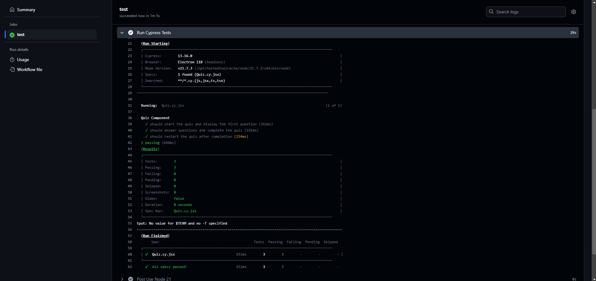
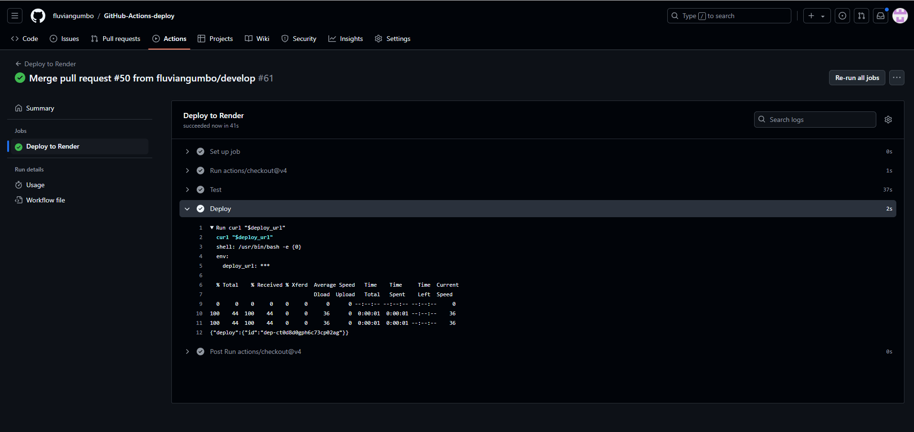

# GitHub Actions CI/CD

## Description

This is a basic demonstration of YAML and Github Actions Workflows used to implement standard development protocols for continuous integration and continuous delivery.

## Table of Contents
1. [Installation](#installation)
2. [Usage](#usage)
3. [Contributing](#contributing)
4. [Tests](#tests)
5. [Questions](#questions)

## Installation

You can access the live application here: https://github-actions-deploy.onrender.com. The repository is located at https://github.com/fluviangumbo/GitHub-Actions-deploy and is where you can see the implementation of the YAML code. 

## Usage

When a pull request is made from a feature breanch to the develop branch, a check is triggered automatically using GitHub Actions that verifies the integrity of the quiz application used to demonstrate the functionality of the workflows. 

When another PR is made from the develop branch to the main branch, another set of checks are run and the application triggers a new Render deployment upon merge.

## Contributing

N/A

## Tests

Simply pull a feature branch and make a small change to a file. If the tests are passed when the PR is made then the branches will carry out the appropriate tests to see if the code can be merged or not.

## Questions

Github: https://github.com/fluviangumbo

Email: jroney002@gmail.com

Contact me at my GitHub profile or my email.